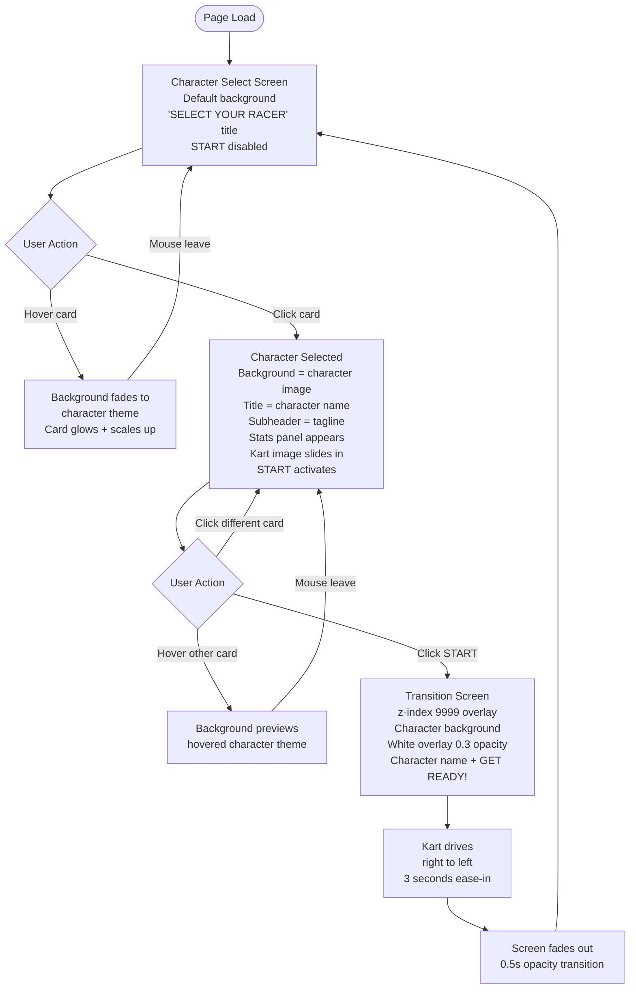

# Hero Faction Screen
**AI 201 — Spring 2026 | SCAD**
**Student:** Art Director
**Tool:** Claude (claude-sonnet-4-6, Claude Code CLI)
**Due:** 2026-04-08

A single-page interactive character select screen for a kawaii pixel art kart racing game. Built with Vite + React + Tailwind CSS. Hosted on GitHub Pages.

**[Live Site →](https://akezi4h-dev.github.io/Character-Select/)**

---

**[→ akezi4h-dev.github.io/Character-Select](https://akezi4h-dev.github.io/Character-Select/)**

---

---

## Design Intent

### Personal Statement

This character screen is to represent my childhood of playing retro games, and pastel color scheme for youth, and my plushies as the characters.

I feel like youth and plushies have been forgotten — like Toy Story — so my goal was to combine a pastel aesthetic, with toys and plushies, to revive childhood through the toys we played with and the scenarios we put our toys in: making stories, going on adventures, racing each other. This screen is about that feeling. It is not just a UI — it is a love letter to imagination.

---

> This design intent was written before any AI-assisted development began. It serves as the evaluative standard against which all AI output was judged throughout the project.


The app should feel like a **cute pixelated pastel racing game lobby** inspired by Japanese kawaii UI and casual Nintendo-style game menus.

The experience should feel playful, soft and dreamy, friendly and collectible, lighthearted and whimsical — somewhere between **Mario Kart and Sanrio aesthetics**.

### Visual Style
- Soft pastel color palette per character (baby blue, mint green, golden yellow, coral orange)
- Full-screen pixel art backgrounds that shift per character
- Press Start 2P pixel font throughout
- Rounded corners, pill-shaped buttons, per-character glow effects
- Character artwork fills card frames edge to edge
- `image-rendering: pixelated` on all pixel art images — no browser smoothing


### Stunning Atmosphere
Full-screen pixel art backgrounds crossfade smoothly between characters on hover and selection. Each character has their own distinct world — beach, swamp, space, river — built from commissioned pixel art. The backgrounds aren't decorations; they are immersive environments that shift in real time to match the character being explored. The kawaii pastel palette, Press Start 2P font, and per-character glow effects combine into a consistent visual register that feels like a real game lobby, not a web page.

### Typography, Color, and Hover States Create a Unified Experience
- **Typography:** Press Start 2P at every level of the hierarchy — 57px title down to 8px kart label. One typeface, differentiated by size only.
- **Color:** A single per-character color system drives everything simultaneously. Selecting Steve turns the title, subheader, detail stats, stat bar labels, card name, bar fill, START button, and transition screen all to his color at once. The screen is fully themed to whoever is selected.
- **Hover states:** Hovering a card triggers three things at once — the card scales up, its border glows in that character's pastel color, and the background crossfades to their world. All three responses are coordinated through the same hover event.

### Layout Responds to Interaction
Every user action changes the screen state:
- **Hover** → background previews the character's world, card highlights
- **Select** → title switches to character name, subheader appears, stats panel and kart slide in, START activates, entire color system shifts
- **START** → full-screen transition animation plays: kart drives right-to-left across the character's background, character name and GET READY displayed, fades back to select

The screen is never static — it is always responding to what the user is doing.

### Type Hierarchy

> Established before development. All AI output was evaluated against these rules.

| Role | Size | Font | Color Rule |
|------|------|------|------------|
| Screen title ("SELECT YOUR RACER" / character name) | 57px | Press Start 2P | `#51A0C8` default → character `color.text` when selected |
| Character subheader (tagline) | 16px | Press Start 2P | character `color.text` |
| Detail stats (Age, Food, Place, Catchphrase, labels) | 16px | Press Start 2P | character `color.text` |
| Stat bar labels (STRENGTH / ABILITY) | 16px | Press Start 2P | character `color.text` |
| Card name | 16px | Press Start 2P | white (unselected) → character `color.border` (selected) |
| Kart label ("[Name]'S KART") | 8px | Press Start 2P | white |
| GET READY! (transition screen) | 24px | Press Start 2P | character `color.text` |
| START button | 16px | Press Start 2P | white |

Single typeface throughout. Hierarchy is established by size only — no weight variation, no serif/sans mixing. Smaller text (8px kart label) is intentionally subordinate and decorative.

### Interaction Model
- Hover a card → background fades to character's theme
- Select a card → title updates to character name, stats panel appears, kart slides in
- Click START → full-screen transition animation plays (kart drives across screen) → loops back to select

### Characters

| Character | Portrait | Theme | Text Color | Card Color Scheme | Intention |
|-----------|----------|-------|------------|-------------------|-----------|
| Steve |  | Beach | `#10517B` | Pastel blues and yellows — border `#7dd3fc` | Steve is a beach seagull who loves french fries. Blues and yellows reflect his fry, water, sky, and sand. |
| Gurchen |  | Swamp | `#436348` | Pastel greens and teals — border `#86efac` | I imagine Gurchen just living his croc life in the swamp. Greens and teals match murky water and swamp plants. |
| Gerald |  | Space | `#142341` | Pastel blues, yellows, and violets — border `#fde047` | I got Gerald from the Smithsonian Space Museum. Blues, yellows, and violets reflect stars, planets, and the cosmos. |
| Barry |  | River | `#295A57` | Pastel oranges and blues — border `#fdba74` | Barry I imagineis a platypus living peacefully by the river. Warm oranges against cool blues reflect the water and the earth. |

### Layout & Character Grid

The screen uses a two-panel layout:
- **Left side:** Character selection grid (always visible, never centered)
- **Right side:** Large character kart preview + stats
- **Bottom:** START button (centered)

#### Character Selection Grid
Four characters arranged in a 2×2 grid:

```
[ Steve ]    [ Gurchen ]

[ Gerald ]   [ Barry  ]
```

Spacing between cards feels playful and airy. Cards are large enough to feel like collectibles — approximately 192×224px — similar to game selection menus.

#### Character Card Design
Each character appears inside a rounded square selection card:

```
┌─────────────────┐
│                 │
│   character     │
│     image       │
│  (full bleed)   │
│                 │
│   character     │
│      name       │
└─────────────────┘
```

- Rounded corners (16–20px radius)
- Soft pastel background
- Light colored gradient border (default) or per-character glow border (selected)
- Character name overlaid at bottom
- Name text: white when unselected, character border color when selected

#### Hover & Selection Behavior
- **Hover:** card scales up, border glows softly, background fades to character theme
- **Selected:** stronger glow, selection ring, preview panel updates on the right
- **Cursor off grid:** background returns to default soft pastel menu background

#### Character Theme Backgrounds

| Character | Theme | Vibe |
|-----------|-------|------|
| Steve | Pixel-art beach — light blue sky, ocean horizon, sandy tones | Soft, bright, summery, relaxed |
| Gurchen | Pixel-art swamp — murky greens, swamp plants, mist | Mysterious, humid, nature-heavy |
| Gerald | Pixel-art space — stars, moon, rocket, and planets | Starry, spacey, cosmic |
| Barry | Pixel-art river — flowing water, smooth stones, soft reflections | Peaceful, cool, flowing |

Background animations are very subtle — birds drifting, leaves moving, water flowing — nothing that distracts from the UI.

---

## Site Flow



---

## AI Direction Log

> Documents moments where the Art Director gave Claude a direction, constraint, or correction that changed the output. Each entry records what AI produced, what was chosen instead, and why that decision belonged to the Art Director.

### Entry 1 — Retro Pixel Restyle Rejected *(2026-04-01)*
Claude restyled every component with sharp pixel-art corners and harsh 8-bit shadows when asked for polish. The Press Start 2P font was kept; everything else was reverted. The Design Intent is kawaii pastel — the font was a retro touch, not an invitation to go full NES.

### Entry 2 — Character Colors Overridden with Exact Hex Values *(2026-04-02)*
Claude used generic pastels. The Art Director supplied exact hex values for each character reflecting their personality and theme. Steve's blue is surfer-coded. Gurchen's lime is froggy. Gerald's yellow is mischievous. Barry's orange is cozy. These were intentional characterizations.

### Entry 3 — Kart Layout Completely Redesigned by Direction *(2026-04-03–04)*
Claude's kart started at ~250px inside a constrained box. The Art Director escalated to 700px, removed the container box entirely, decoupled the right panel from flex flow via `position: absolute`, added the `slideInKart` CSS keyframe animation triggered by `key={character?.id}`, and separated the shadow into an independent static element.

### Entry 4 — Title Behavior Locked Down to Prevent Layout Shift *(2026-04-04–05)*
Dynamic title text ("SELECT YOUR RACER" ↔ "STEVE") caused grid reflow. The Art Director identified the root cause and specified fixed-height container + `white-space: nowrap` to keep bounding boxes stable regardless of content.

### Entry 5 — Kart Display Has No Box *(2026-04-03)*
Claude framed the kart in a detail panel with background tint and borders. The Art Director specified no box, no background, no border — the character floats in the background of their world. Absence as a design decision.

### Entry 6 — Emoji Karts Replaced with Real PNG Artwork *(2026-04-07)*
Four unique pixel art kart PNG images replaced the generic `🏎️` emoji. Each character got their own `kartImage` field wired to their artwork.

### Entry 7 — Character Cards: Full-Bleed Image Over Separate Avatar *(2026-04-07)*
Doubling card size broke the grid. The Art Director directed full-bleed (`position: absolute; inset: 0; object-fit: cover`) with character name overlaid at bottom — turning each card into a mini portrait.

### Entry 8 — Text Stroke System: Multiple Iterations → Removed Entirely *(2026-04-07)*
Claude built a `::before` pseudo-element stroke system. The Art Director iterated: white → black → 2px → 0.5px → removed entirely. Plain white text on pixel art backgrounds needed no stroke.

### Entry 9 — Character Text Colors: Saturated → Muted Dark Palette *(2026-04-07)*
Vibrant saturated character colors clashed with detailed pixel art backgrounds. All four replaced with darker, more muted tones that ground the text against complex imagery.

### Entry 10 — Background Images: Procedural Gradients Replaced with Pixel Art *(2026-04-07)*
CSS gradient backgrounds replaced with commissioned pixel art PNGs per character theme plus a default. The stacked opacity-fade transition system was kept — only the content of each layer changed.

### Entry 11 — Transition Screen: Animation Direction *(2026-04-07)*
Claude defaulted to left-to-right kart movement and 2.5s duration. The Art Director changed to right-to-left (reads as "driving away"), tuned duration to 3s, positioned kart at `top: 400px` to clear the title.

### Entry 12 — Character Card Portraits: Second Round of Artwork *(2026-04-07)*
Four new pixel art character portraits replaced the first-round images. Each character's card image updated to reflect their final visual identity: Steve as a duck/seagull, Gurchen as a crocodile, Gerald as a monkey, Barry as a platypus.

### Entry 13 — Character Colors Applied to All Text via CSS Variable System *(2026-04-07)*
Text throughout the screen was white regardless of character selection. The Art Director specified that title, subheader, detail stats, stat bar labels, and card name should all shift to the selected character's `color.text` value when a character is chosen. Implemented via `--char-color` CSS custom property passed through inline styles — fallback to white when unset.

### Entry 14 — Card Name Text: White by Default, Border Color When Selected *(2026-04-07)*
The Art Director refined the card name behavior independently from body text: unselected cards show white names; selected card shows the character's border color (`color.border`). Isolated to `.card-name` via its own `--card-border-color` CSS variable so no other text is affected.

### Entry 15 — SELECT YOUR RACER Title Color Set to `#51A0C8` *(2026-04-07)*
The default title was white. The Art Director specified `#51A0C8` (sky blue) for the idle state only. When a character is selected the title still switches to their character color. Implemented by defaulting the `--char-color` variable to `#51A0C8` on the title element only.

### Entry 16 — Pixel Art Rendering: `image-rendering: pixelated` Applied Site-Wide *(2026-04-07)*
Character card images and background images appeared blurry due to browser bilinear upscaling. The Art Director identified the issue and directed `image-rendering: pixelated` on both the card `` elements and the background `<div>` elements — forcing nearest-neighbor scaling to preserve crisp pixel art edges.

### Entry 17 — Claude Chat Used as Prompt Intermediary and Coding Advisor *(2026-04-01–07)*
The Art Director used a separate Claude.ai chat session to translate design intent — including reference images of the AngelKart Stamp Rally screen — into precise technical prompts for Claude Code. Claude chat provided CSS variable architecture, the DOM removal trick for animation retrigger, fixed-size kart container pattern, character color lookup object structure, glass morphism stat bar CSS, and the full rebuild spec. All creative decisions remained with the Art Director; Claude chat was the technical translator.

### Entry 18 — AngelKart Reference Images Drove Kart and Layout Direction *(2026-04-01–06)*
The Art Director shared AngelKart Stamp Rally screenshots with Claude chat repeatedly. Claude chat extracted specific measurements and behaviors from the images — kart dominance over the right panel, no container box, static oval shadow — and generated Claude Code prompts from them. The reference images were the creative source; Claude chat was the interpreter.

### Entry 19 — Nav Buttons Removed, Replaced with Glass Morphism Stat Bars *(2026-04-06)*
The Art Director replaced ITEMS/POWER-UPS/KARTS nav buttons with animated stat bars (STRENGTH and ABILITY). Stat values were personally assigned to reflect each character's personality. Iterated through four bar styles — dark border, white border, dark glossy, glass morphism — before settling on the glass morphism style matching the card opacity.

### Entry 20 — Character Detail Stats: Original Character Writing *(2026-04-06)*
All character biography data was written by the Art Director personally — ages, favorite foods, favorite places, catchphrases. Each reflects deliberate characterization: Gerald eats freeze dried bananas (space monkey), Barry's catchphrase references Perry the Platypus, Steve's catchphrase SQWA is a seagull noise. No AI generated this content.

### Entry 21 — Full Rebuild Spec: Decided to Start Fresh Rather Than Keep Patching *(2026-04-06)*
After accumulated patches broke the layout beyond repair, the Art Director made the call to start fresh. Claude chat diagnosed the problem ("too many conflicting instructions") and wrote a comprehensive rebuild spec covering every component, position, color, and animation. The decision to throw away the patched code and rebuild from a clean slate was the Art Director's judgment call.

[Full log with detailed entries →](docs/ai-direction-log.md)

---

## Records of Resistance

> Documents every moment where AI went against my design intention or produced something wrong. Each entry records: what I wanted, what AI made, why it went wrong (vague prompt, ignored directions, hallucination, coding issue), and how I corrected it with a new prompt.

### Record 1 — No Local Node.js Environment *(2026-03-31, ongoing)*
User's machine has no Node.js. All testing done via GitHub Pages deploys (~1 min turnaround). GitHub Actions as the sole preview mechanism.

### Record 2 — CI/CD Lock File Mismatch *(2026-03-31)*
`npm ci` required a lock file that didn't exist. Switched workflow to `npm install`, which regenerates dependencies without one.

### Record 3 — Kart Overflow & Centering *(2026-04-06)*
700px kart clipped by containers. Fixed by addressing the container first: `overflow: visible`, `alignSelf: stretch`, shadow separated into a static sibling element, `key={character?.id}` for clean animation replay.

### Record 4 — CSS Gradient Borders Don't Support Border-Radius *(2026-04-07)*
`borderColor` doesn't accept gradients. Used the `background-clip: padding-box, border-box` technique with `border: 4px solid transparent` — renders gradient only in the border zone while preserving rounded corners.

### Record 5 — Pseudo-Element Stroke Hidden by Stacking Context *(2026-04-07)*
`::before { z-index: -1 }` stroke disappeared on card names because the `<button>` parent created a stacking context that buried it. Fixed with `paint-order: stroke fill` and `-webkit-text-stroke` directly on the element — no z-index required.

### Record 6 — CSS `transition: background-image` Doesn't Work *(2026-04-07)*
Browser doesn't support transitioning `background-image`. The existing stacked opacity-div architecture in `BackgroundLayer.jsx` already solved this — each theme gets its own `position: absolute; inset: 0` div fading via `opacity` transition. Background images dropped in with no transition system changes needed.

### Record 7 — Git Worktree Cannot Checkout Active Branch *(2026-04-07)*
`git checkout main` in the worktree failed: `fatal: 'main' is already used by worktree`. Pushed directly to `origin/main` using `git push origin claude/competent-haibt:main` — bypasses local checkout requirement entirely.

### Record 8 — Pixel Art Blurry at Card and Screen Scale *(2026-04-07)*
Both character card images and full-screen background images appeared blurry. Browser bilinear filtering smooths pixel art when scaling up, destroying the crisp pixel edges. Applied `image-rendering: pixelated` to card `` elements and to the background `<div>` elements using CSS `background-image`. The property works on both `` tags and `background-image` divs — forcing nearest-neighbor scaling at any display size.

### Record 16 — Claude Code Accumulated Conflicting Patches: Required Full Rebuild *(2026-04-06)*
After many sessions of incremental fixes, every correction created a new problem. Claude Code was patching on top of contradictory CSS rules without resolving the conflicts. Claude chat diagnosed the issue and recommended starting fresh. The Art Director made the call to rebuild from a clean spec rather than keep patching.

### Record 17 — Kart Overflow and Clipping: Multiple Failed Fix Attempts *(2026-04-03–06)*
Claude Code repeatedly clipped the kart at panel edges. Each fix addressed the immediate symptom without checking the full container hierarchy — `overflow: hidden` anywhere in the parent chain clips child elements. Resolved by using a fixed-size kart container (`flex-shrink: 0; overflow: visible`) so the kart image cannot affect or be clipped by the flex layout.

### Record 18 — Stats Panel Overlapping Title: Absolute Positioning Without Offset *(2026-04-06)*
Claude Code placed the stats block using `position: absolute` from `top: 0` without subtracting the title height. Stats appeared over the title. Claude chat diagnosed the root cause: *"absolute positioned elements ignore other elements around them."* Fixed by adding explicit `padding-top` to clear the title area.

### Record 19 — GitHub Pages Deployment Queue Stuck *(2026-04-06)*
After rapid pushes during a debugging session, the deployment queue backed up and the workflow showed "waiting" for 10+ minutes. Not a code issue — earlier deployments were blocking newer ones. Fixed by cancelling all queued workflows in the Actions tab except the most recent.

### Record 20 — Card Grid Shifting on Click: Identified via Claude Chat *(2026-04-01–05)*
The card grid visibly jumped on every character click. Claude Code tried padding adjustments — a symptomatic fix. Claude chat identified the root cause: title text switching between "SELECT YOUR RACER" and "STEVE" caused browser layout reflow. Fixed with fixed-height title container + `white-space: nowrap` and right panel decoupled from flex flow via `position: absolute`.

[Full log with detailed entries →](docs/records-of-resistance.md)

---

## Tech Stack

- **Vite** + **React** + **Tailwind CSS**
- **GitHub Actions** → GitHub Pages (auto-deploy on push to `main`)
- **Press Start 2P** (Google Fonts)

## Components

| Component | Purpose |
|-----------|---------|
| `GameMenu` | Root layout, state management, theme coordination |
| `BackgroundLayer` | Stacked opacity-faded theme layers |
| `CharacterGrid` | 2×2 card grid |
| `CharacterCard` | Full-bleed image card with hover/select states |
| `KartDisplay` | Kart image with slide-in animation |
| `StatBars` | Glass morphism animated stat bars |
| `StartButton` | Fixed bottom center, color-synced to character |
| `TransitionScreen` | Full-screen kart drive animation on START |
| `DevGrid` | Developer grid overlay (toggle with G key) |
