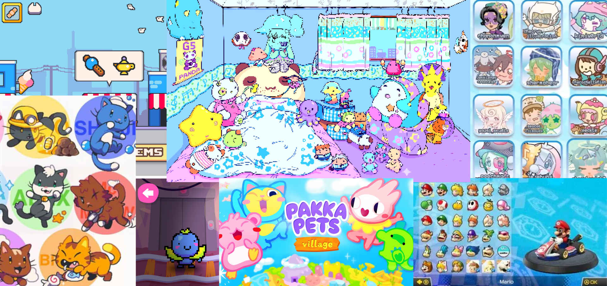

# Design Intent 1 (Original)
## AI 201 — Hero Faction Screen | Spring 2026
**Student:** Art Director
**Tool:** Claude (claude-sonnet-4-6, Claude Code CLI)
**Due:** 2026-04-08

---

> This design intent was written before any AI-assisted development began. It serves as the evaluative standard against which all AI output was judged throughout the project.

---

## Personal Statement

This character screen is to represent my childhood of playing retro games, and pastel color scheme for youth, and my plushies as the characters.

I feel like youth and plushies have been forgotten — like Toy Story — so my goal was to combine a pastel aesthetic, with toys and plushies, to revive childhood through the toys we played with and the scenarios we put our toys in: making stories, going on adventures, racing each other. This screen is about that feeling. It is not just a UI — it is a love letter to imagination.

---

## Moodboard

---

*Last updated: 2026-04-08*
