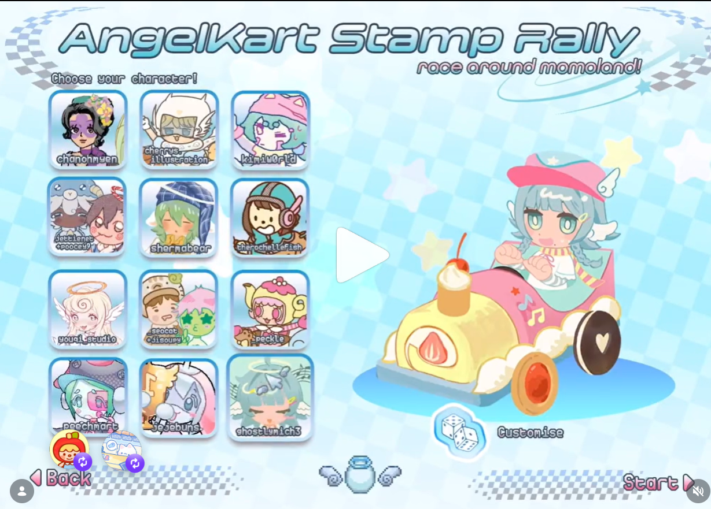
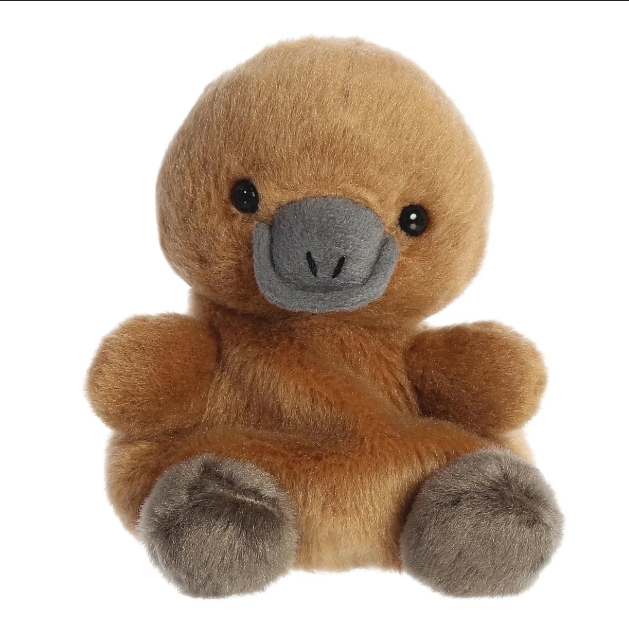
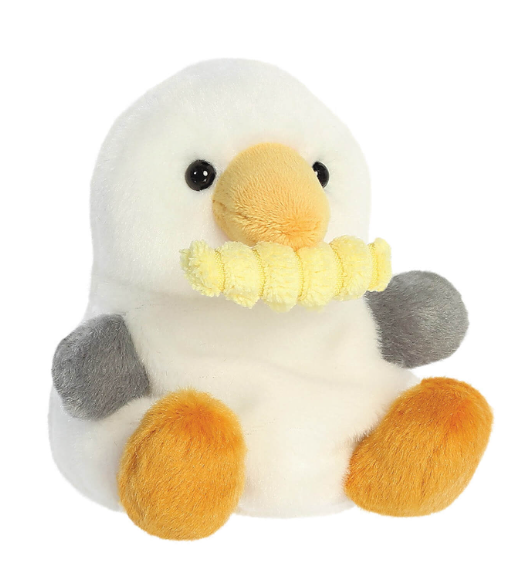
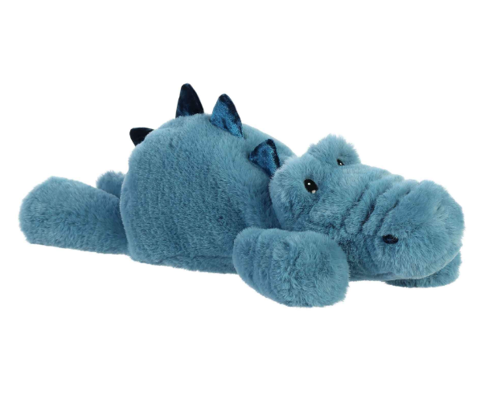
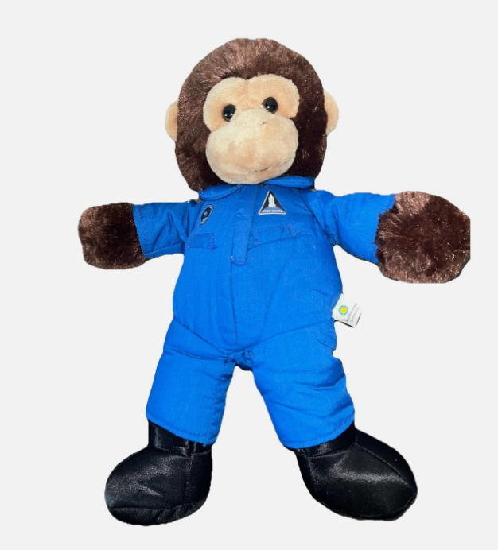

# Design Intent 1 (Original)
## AI 201 — Hero Faction Screen | Spring 2026
**Student:** Art Director
**Tool:** Claude (claude-sonnet-4-6, Claude Code CLI)
**Due:** 2026-04-08

---

> This is the original design intent — Design Intent 1. This was made before any AI coding. Version 1 is the human written one while Version 2 I put in this prompt and AI assisted me to make it more specific for Claude.

---

## Moodboard


---

## Personal Statement

This character screen is to represent my childhood of playing retro games, and pastel color scheme for youth, and my plushies as the characters.

I feel like youth and plushies have been forgotten — like Toy Story — so my goal was to combine a pastel aesthetic, with toys and plushies, to revive childhood through the toys we played with and the scenarios we put our toys in: making stories, going on adventures, racing each other. This screen is about that feeling. It is not just a UI — it is a love letter to imagination.

---

## Design Intent 1 v.1 — Human Written

I wanted the app to feel like this Angel Kart scene reference I saw on Instagram but also I wanted it to be based on my own 4 characters who are Steve, Gurchen, Gerald, and Barry:



This game is a character screen with an overall pastel 2000s vibe and is a selection screen based on my 4 plushies. The typography should be fun and entertaining.

---

### Barry

Barry is a Platypus based on the Platypus Palm Pals Plush:



Barry is river themed and when hovering over him it plays his color: **Pastel Orange**
Barry has a river themed background.

---

### Steve

Steve is a Seagull based on the Seagull Palm Pals Plush:



Steve is beach themed and when hovering over him it plays his color: **Pastel Blue**
Steve's intent is to have a more beach related theme. Make flying bird animations in the background.

---

### Gurchen

Gurchen is a Crocodile based on the Crocodile Plush I had that my boyfriend gave to me:



Gurchen is swamp themed and when hovering over him it plays his color: **Pastel Green**
Gurchen is more swamp themed so try having a swamp background.

---

### Gerald

Gerald is a Monkey based on the Monkey Plush I bought in the Smithsonian Space Museum:



Gerald is jungle themed and when hovering over him it plays his color: **Pastel Yellow**

---

### Hover Interaction (v.1)

When hovering over the characters I wanted:
- The border of the character card to change
- The size of the character card to be bigger
- The background to change to that specific character's theme when hovering

---

## Design Intent 1 v.2 — AI Assisted but Human Written

### 1. Overall Experience

The app should feel like a cute pastel racing game lobby inspired by Japanese kawaii UI and casual Nintendo-style game menus.

The experience should feel:
- Playful
- Soft and dreamy
- Friendly and collectible
- Lighthearted and whimsical

The interface should feel like the start screen of a cute kart racing game, where players choose characters before starting a race. The design should feel **joyful and cozy rather than competitive**.

---

### 2. Visual Style

**Color Palette**
Use soft pastel colors:
- Baby blue background
- Soft pink accents
- Creamy yellows
- Mint green
- Lavender

The palette should feel cotton-candy-like and dreamy. Avoid harsh colors or dark tones.

**Background**
The background should feel light and playful, not empty.

**UI Elements**
All UI components should have:
- Rounded corners
- Soft shadows
- Pill-shaped buttons
- Thick friendly outlines
- Subtle glow or highlight

Everything should feel **soft and toy-like**, like plastic game pieces.

---

### 3. Character Selection Grid

The left side should show a grid of selectable character icons.

Structure:
- 3 columns
- Multiple rows
- Square character cards

Each card should have:
- Rounded square frame
- Pastel border
- Cute character avatar
- Creator/character name under it

**Interaction behavior:**

When hovering:
- Card slightly scales up
- Border glows
- Soft bounce animation
- Background changes to the character's theme

When selected:
- Card highlights
- Soft glow appears

---

### 4. Main Character Display

The right side should display a large featured character sitting in a whimsical kart.

Design details:
- The kart should look like a toy vehicle
- Candy-like materials
- Musical notes / cute decorations
- Heart-shaped wheels or accents

The character should feel:
- Chibi
- Expressive
- Soft colors
- Big eyes

---

### 5. Primary UI Actions

**Start Button** — Located bottom right:
- Big rounded button
- Pastel pink or mint
- Soft glow
- Playful font
- Hover: gentle bounce + sparkle effect

**Customize Button** — Near the kart:
- Dice icon
- Rounded bubble button
- Hover animation

**Back Button** — Bottom left:
- Arrow icon
- Pastel tone
- Subtle hover effect

---

### 6. Typography

Typography should feel cute and game-like:
- Rounded sans-serif
- Bubbly shapes
- Slightly thick
- Readable but playful

Avoid corporate fonts.

---

### 7. Motion & Microinteractions

The UI should feel alive. Include:
- Floating stars
- Gentle background movement
- Character idle animation
- UI hover bounce
- Button squish animation

Animations should feel: **soft, springy, slow and satisfying**.

---

### 8. Layout Structure

Two-panel layout:

**Left panel:** Character selection grid

**Right panel:**
- Large character preview
- Kart display
- Customize button

**Bottom bar:**
- Back button (left)
- Start button (right)

---

### 9. Technical Instructions (Vite)

Build using:
- Vite
- React
- Tailwind CSS

Components:
- `GameMenu`
- `CharacterGrid`
- `CharacterCard`
- `CharacterPreview`
- `KartDisplay`
- `StartButton`
- `CustomizeButton`
- `BackButton`

Animations:
- CSS transitions
- Small spring animations
- Hover scale effects

---

### 10. Tone of the Product

The app should feel like:
- A collectible character racing game
- Something between **Mario Kart and Sanrio aesthetics**
- Joyful and adorable

**The UI should feel like a toy you want to click on.**

---

### 11. Character System

This screen contains a 2×2 grid of four playable characters on the left side.

Characters: Steve, Gurchen, Gerald, Barry

For now, use placeholder emojis instead of artwork. The real character art will be swapped in later.

| Character | Emoji |
|-----------|-------|
| Steve | 🏄 |
| Gurchen | 🐸 |
| Gerald | 🐒 |
| Barry | 🦦 |

Each character card should show: emoji avatar, character name, rounded pastel selection container.

---

### 12. Hover Interaction

When the user hovers over a character card, three things should happen:

**1. Card Highlight**
The card changes to a pastel color depending on the character:
- Steve → Pastel Blue
- Gurchen → Pastel Green
- Gerald → Pastel Yellow
- Barry → Pastel Orange

The hover effect should include: soft glow, slight scale up, smooth transition animation.

**2. Background Theme Change**
Hovering a character should temporarily change the entire screen background to a pixel-art themed environment matching the character vibe.

---

### 13. Character Themed Backgrounds

**Steve — Beach Theme**
Light blue sky, pixel ocean horizon, sandy tones, small flying bird animations. Vibe: soft, bright, summery, relaxed.

**Gurchen — Swamp Theme**
Murky green water, swamp plants, dark green tones, occasional bubbles or swamp mist. Vibe: mysterious, humid, nature-heavy.

**Gerald — Jungle Theme**
Dense green leaves, vines, layered foliage silhouettes. Vibe: lush, vibrant, wild, adventurous.

**Barry — River Theme**
Flowing water, smooth stones, soft reflections, water movement animation. Vibe: peaceful, cool, flowing.

---

### 14. Background Animations

Animations should be very subtle:
- Birds slowly flying
- Leaves gently moving
- Water flowing slightly
- Mist drifting

Nothing should distract from the UI.

---

### 15. Reset Behavior

If the user moves the cursor off the character grid, the background should return to the default soft pastel menu background.

---

### 16. Vibe

The entire interface should maintain: pastel colors, rounded UI elements, soft shadows, playful game-like feel. The pixel backgrounds should feel like retro game environments.

---

### 17. Implementation Notes

Use React state to track hovered character, CSS transitions for smooth color changes, layered background div for pixel scene swapping.

Structure:
```
GameMenu
├ CharacterGrid
│   ├ CharacterCard
│   ├ CharacterCard
│   ├ CharacterCard
│   └ CharacterCard
└ BackgroundLayer
```

---

*Last updated: 2026-04-08*
