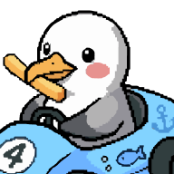
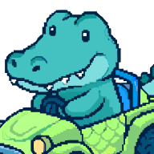
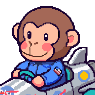
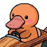

# Design Intent
## AI 201 — Hero Faction Screen | Spring 2026
**Student:** Art Director
**Tool:** Claude (claude-sonnet-4-6, Claude Code CLI)
**Due:** 2026-04-08

---

> This design intent was written before any AI-assisted development began. It serves as the evaluative standard against which all AI output was judged throughout the project.

---

## Personal Statement

This character screen is to represent my childhood of playing retro games, and pastel color scheme for youth, and my plushies as the characters.

I feel like youth and plushies have been forgotten — like Toy Story — so my goal was to combine a pastel aesthetic, with toys and plushies, to revive childhood through the toys we played with and the scenarios we put our toys in: making stories, going on adventures, racing each other. This screen is about that feeling. It is not just a UI — it is a love letter to imagination.

---

## Overall Experience

The app should feel like a **cute pixelated pastel racing game lobby** inspired by Japanese kawaii UI and casual Nintendo-style game menus.

The experience should feel playful, soft and dreamy, friendly and collectible, lighthearted and whimsical — somewhere between **Mario Kart and Sanrio aesthetics**.

---

## Stunning Atmosphere

Full-screen pixel art backgrounds crossfade smoothly between characters on hover and selection. Each character has their own distinct world — beach, swamp, space, river — built from commissioned pixel art. The backgrounds aren't decorations; they are immersive environments that shift in real time to match the character being explored. The kawaii pastel palette, Press Start 2P font, and per-character glow effects combine into a consistent visual register that feels like a real game lobby, not a web page.

---

## Visual Style

- Soft pastel color palette per character (baby blue, mint green, golden yellow, coral orange)
- Full-screen pixel art backgrounds that shift per character
- Press Start 2P pixel font throughout
- Rounded corners, pill-shaped buttons, per-character glow effects
- Character artwork fills card frames edge to edge
- `image-rendering: pixelated` on all pixel art images — no browser smoothing

---

## Typography, Color, and Hover States Create a Unified Experience

- **Typography:** Press Start 2P at every level of the hierarchy — 57px title down to 8px kart label. One typeface, differentiated by size only.
- **Color:** A single per-character color system drives everything simultaneously. Selecting Steve turns the title, subheader, detail stats, stat bar labels, card name, bar fill, START button, and transition screen all to his color at once. The screen is fully themed to whoever is selected.
- **Hover states:** Hovering a card triggers three things at once — the card scales up, its border glows in that character's pastel color, and the background crossfades to their world. The title and subheader also preview that character's text color. All responses are coordinated through the same hover event.

---

## Layout Responds to Interaction

Every user action changes the screen state:
- **Page load** → CRITTER CUP title screen: title fades in, four karts drive in from the right one by one, PLAY button appears
- **Click PLAY** → title screen fades out, character select screen loads
- **Hover** → background previews the character's world, card highlights, title and subheader preview character text color
- **Select** → title switches to character name, subheader appears, stats panel and kart slide in, START activates, entire color system shifts
- **START** → full-screen transition animation plays: confetti falls, kart drives right-to-left across the character's background, character name and GET READY displayed, fades back to select

The screen is never static — it is always responding to what the user is doing.

---

## Type Hierarchy

> Established before development. All AI output was evaluated against these rules.

| Role | Size | Font | Color Rule |
|------|------|------|------------|
| Screen title ("SELECT YOUR RACER" / character name) | 57px | Press Start 2P | `#51A0C8` default → character `color.text` on hover or select |
| Character subheader (tagline) | 16px | Press Start 2P | character `color.text` on hover or select |
| Detail stats (Age, Food, Place, Catchphrase, labels) | 16px | Press Start 2P | character `color.text` when selected |
| Stat bar labels (Strength / Ability) | 16px | Press Start 2P | character `color.text` when selected |
| Card name | 16px | Press Start 2P | white (unselected) → character `color.cardName` (selected) |
| Kart label ("[Name]'S KART") | 8px | Press Start 2P | white |
| GET READY! (transition screen) | 24px | Press Start 2P | character `color.text` |
| START button | 16px | Press Start 2P | white label; character `color.button ?? color.text` background (Gerald uses `#293964`) |
| CRITTER CUP title (title screen) | 96px | Press Start 2P | `#353290` indigo with sweeping shimmer animation (10s loop) |

Single typeface throughout. Hierarchy is established by size only — no weight variation, no serif/sans mixing.

---

## Interaction Model

- Page load → CRITTER CUP title screen appears: title fades in, 4 karts drive in from right one by one, PLAY button fades in
- Click PLAY → title screen fades out, character select screen fades in
- Hover a card → background fades to character's theme, title and subheader preview that character's text color
- Select a card → title updates to character name, stats panel appears, kart slides in, all text shifts to character color
- Click START → full-screen transition animation plays: confetti falls, kart drives right-to-left across character background → loops back to select

---

## Characters

| Character | Portrait | Theme | Text Color | Card Color Scheme | Intention |
|-----------|----------|-------|------------|-------------------|-----------|
| Steve |  | Beach | `#10517B` | Pastel blues and yellows — border `#7dd3fc` | Steve is a beach seagull who loves french fries. Blues and yellows reflect his fry, water, sky, and sand. |
| Gurchen |  | Swamp | `#436348` | Pastel greens and teals — border `#86efac` | I imagine Gurchen just living his croc life in the swamp. Greens and teals match murky water and swamp plants. |
| Gerald |  | Space | `#142341` | Pastel blues, yellows, and violets — border `#fde047` | I got Gerald from the Smithsonian Space Museum. Blues, yellows, and violets reflect stars, planets, and the cosmos. |
| Barry |  | River | `#295A57` | Pastel oranges and blues — border `#fdba74` | Barry I imagine is a platypus living peacefully by the river. Warm oranges against cool blues reflect the water and the earth. |

---

## Layout & Character Grid

The screen uses a two-panel layout:
- **Left side:** Character selection grid (always visible, never centered)
- **Right side:** Large character kart preview + stats
- **Bottom:** START button (centered)

### Character Selection Grid
Four characters arranged in a 2×2 grid:

```
[ Steve ]    [ Gurchen ]

[ Gerald ]   [ Barry  ]
```

Spacing between cards feels playful and airy. Cards are large enough to feel like collectibles — approximately 192×224px — similar to game selection menus.

### Character Card Design
Each character appears inside a rounded square selection card:

```
┌─────────────────┐
│                 │
│   character     │
│     image       │
│  (full bleed)   │
│                 │
│   character     │
│      name       │
└─────────────────┘
```

- Rounded corners (16–20px radius)
- Soft pastel background
- Light colored gradient border (default) or per-character glow border (selected)
- Character name overlaid at bottom
- Name text: white when unselected, character `color.cardName` when selected

### Hover & Selection Behavior
- **Hover:** card scales up, border glows softly, background fades to character theme, title and subheader preview that character's color
- **Selected:** stronger glow, selection ring, preview panel updates on the right, all text shifts to character color
- **Cursor off grid:** background returns to default soft pastel menu background, title returns to `#51A0C8`

---

## Character Theme Backgrounds

| Character | Theme | Vibe |
|-----------|-------|------|
| Steve | Pixel-art beach — light blue sky, ocean horizon, sandy tones | Soft, bright, summery, relaxed |
| Gurchen | Pixel-art swamp — murky greens, swamp plants, mist | Mysterious, humid, nature-heavy |
| Gerald | Pixel-art space — stars, moon, rocket, and planets | Starry, spacey, cosmic |
| Barry | Pixel-art river — flowing water, smooth stones, soft reflections | Peaceful, cool, flowing |

Background animations are subtle — floating emoji themed to each character's world (birds, bubbles, astronomy icons, water drops). Nothing that distracts from the UI.

---

## Title Screen

The CRITTER CUP title screen is the first thing the player sees. It establishes the racing game identity before any character is selected.

- Full-screen pixel art racing track background
- CRITTER CUP title in 96px Press Start 2P, `#353290` indigo with a 10s sweeping shimmer animation
- Four karts drive in from the right side one by one with staggered delays (Gurchen 0.5s → Gerald 0.9s → Steve 1.3s → Barry 1.7s)
- PLAY button fades in centered on screen
- Clicking PLAY fades out the title screen and reveals the character select screen beneath it

---

## Technical Stack

- **Vite** + **React** + **Tailwind CSS**
- **GitHub Actions** → GitHub Pages (auto-deploy on push to `main`)
- **Press Start 2P** (Google Fonts)

### Components

| Component | Purpose |
|-----------|---------|
| `App` | Root state: controls TitleScreen visibility |
| `TitleScreen` | Full-screen pre-game title with CRITTER CUP, staggered kart drive-in, PLAY button |
| `GameMenu` | Root layout, state management, theme coordination |
| `BackgroundLayer` | Stacked opacity-faded theme layers |
| `CharacterGrid` | 2×2 card grid |
| `CharacterCard` | Full-bleed image card with hover/select states |
| `KartDisplay` | Kart image with slide-in animation |
| `StatBars` | Glass morphism animated stat bars |
| `StartButton` | Fixed bottom center, color-synced to character |
| `TransitionScreen` | Full-screen kart drive + confetti animation on START |
| `DevGrid` | Developer grid overlay (toggle with G key) |

---

*Last updated: 2026-04-07*
